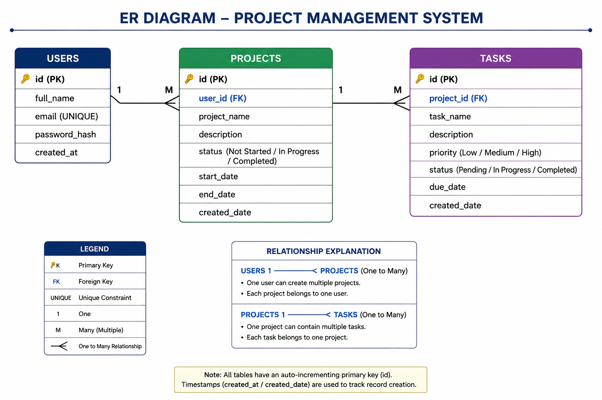
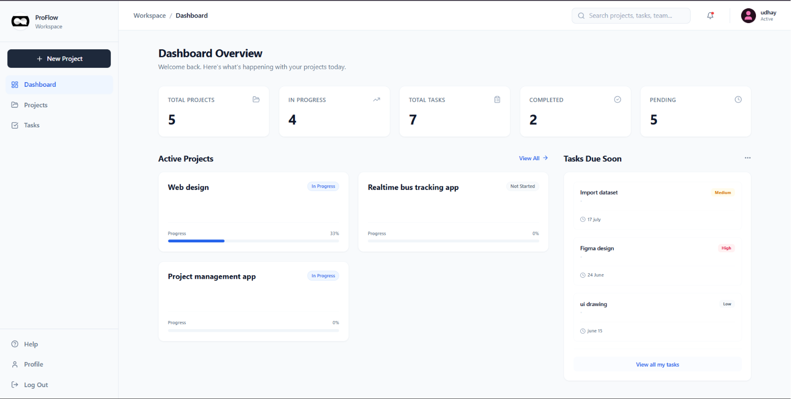
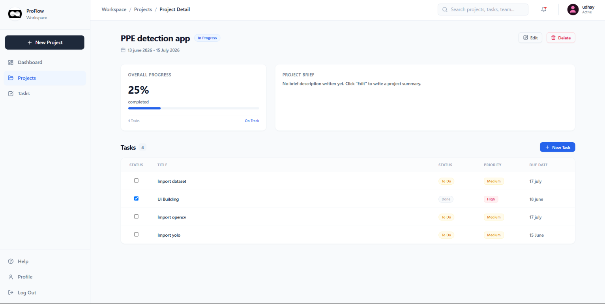
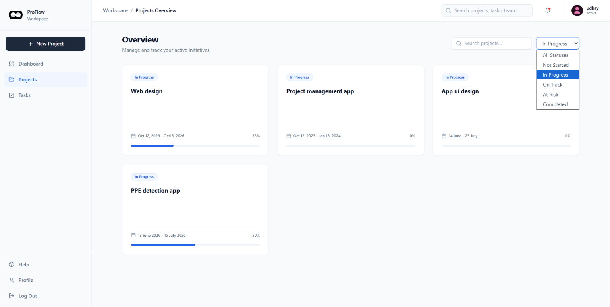
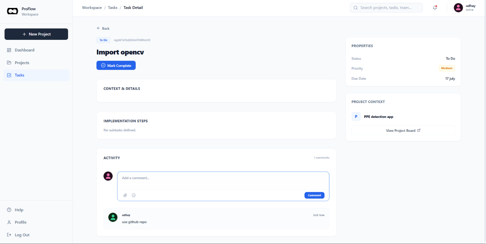
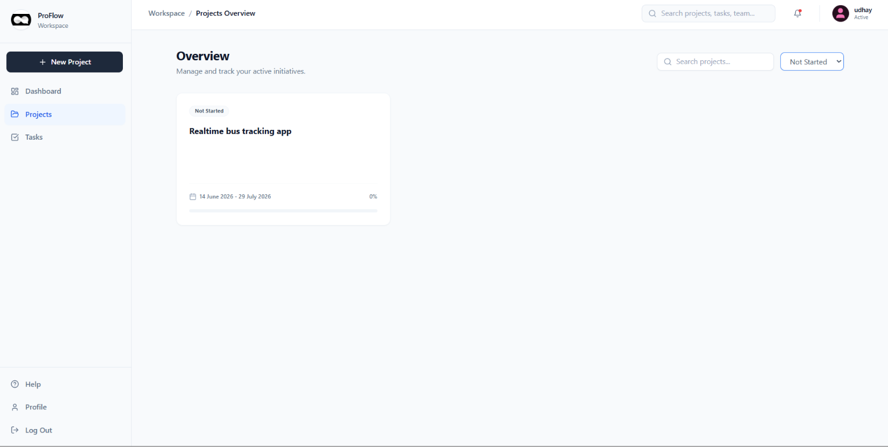
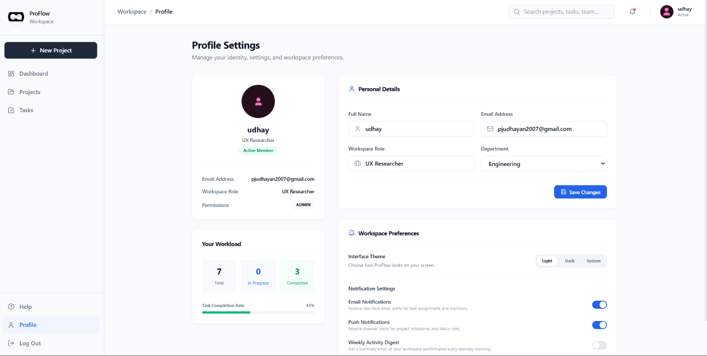

# Project Management App

A comprehensive project management application designed for individual productivity, allowing users to track projects, manage tasks, and stay organized with a sleek and modern UI.

## Technology Stack

**Frontend:**
- **Next.js (React):** App router, server components, and seamless navigation.
- **Tailwind CSS:** Modern utility-first styling with comprehensive dark mode support.
- **Lucide React:** Beautiful, consistent iconography.
- **Zustand (Custom Hooks):** Lightweight global state management.

**Backend:**
- **Node.js & Express:** Robust server architecture and RESTful API endpoints.
- **MySQL:** Relational database for structured data storage.

## Backend Logic

The backend is built with modularity in mind, separating concerns across routes, controllers, and middleware:
- **Routes:** Direct incoming API requests to the appropriate controllers.
- **Controllers:** House the core business logic (e.g., project and task management operations).
- **Middleware:** Reusable functions for tasks such as error handling, rate limiting, and authentication.

## JWT Authentication

Authentication is handled securely using JSON Web Tokens (JWT):
- Upon successful login, the server generates a signed JWT containing user claims.
- The client stores this token securely and includes it in the `Authorization` header of subsequent requests.
- Protected backend routes verify the token using custom middleware, rejecting unauthorized requests and ensuring that users only access their own data.

## SQL Injection Prevention

Security is a primary concern, particularly when interacting with the MySQL database:
- **Parameterized Queries:** All database interactions use prepared statements and parameterized queries (using `mysql2` promises).
- User input is never directly concatenated into SQL strings, effectively neutralizing SQL injection vulnerabilities by ensuring the database treats input strictly as data, not executable code.

## Database Design

The database is structured to efficiently manage the core entities of the application: Projects, Tasks, and Users. Relationships are strictly enforced using foreign keys with cascading updates/deletes to maintain referential integrity.

### ER Diagram

## UI/UX Design

The application features a modern, clean, and highly responsive user interface:
- **Dark Mode:** A fully integrated dark theme that respects user preferences, utilizing Tailwind's dark mode utility classes across all components.
- **Responsive Layouts:** Carefully crafted using Flexbox and CSS Grid to ensure an optimal experience across desktop, tablet, and mobile devices.
- **Interactive Elements:** Smooth transitions, micro-interactions, and clear visual hierarchy (e.g., color-coded priorities and statuses) enhance usability.

### Frontend Screenshots

## Conclusion

This Project Management App demonstrates a full-stack, scalable approach to building productivity tools. By combining a modern Next.js frontend with a secure Node.js/MySQL backend, it delivers a robust, visually appealing, and highly functional user experience tailored for personal task organization.
